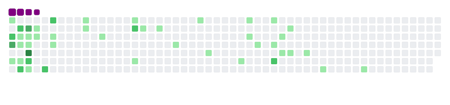

# Hola, Yo soy Orianna Núñez 🚀👋

## Yo en el work 👩‍💻:
*Empresa: ACHS*
*Rol: Devops*
*Actividades principales: Automatización de procesos, creación de infraestructuras con terraform, mantención de clústeres Kubernetes, creación y control de pipelines de despliegue de aplicaciones, definición de procesos para la gestión de proyectos.*

## Yo en la web 🌎:
- Mi linkedin <a target="_blank" href="https://www.linkedin.com/in/oriverhu/">Linkedin</a>💼
- Mi Github <a target="_blank" href="https://github.com/oriverhu">Github</a>
- Otro: <a target="_blank" href="https://oriverhu.herokuapp.com/">Portfolio</a>

